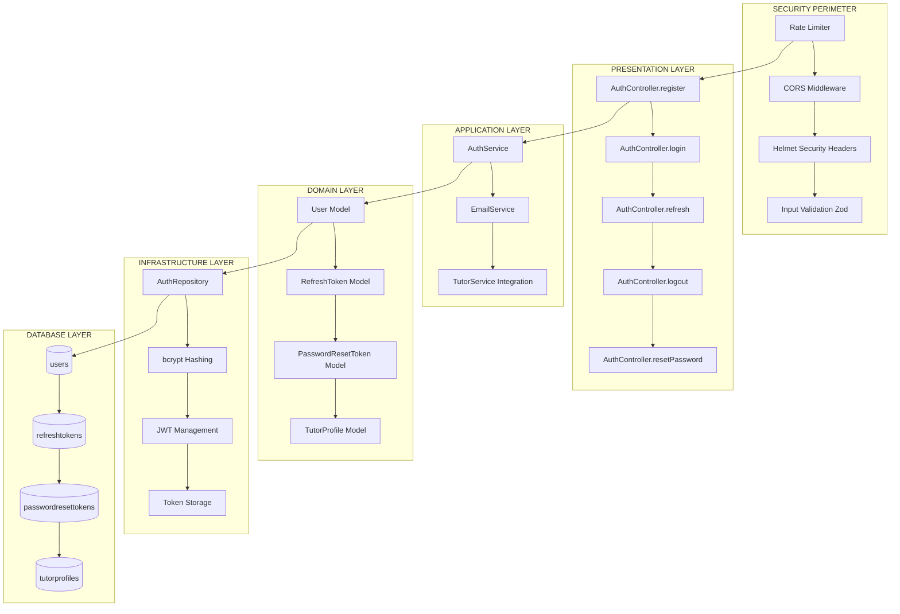
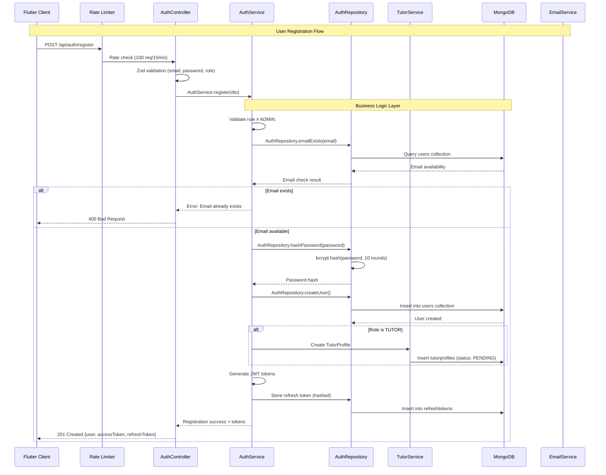
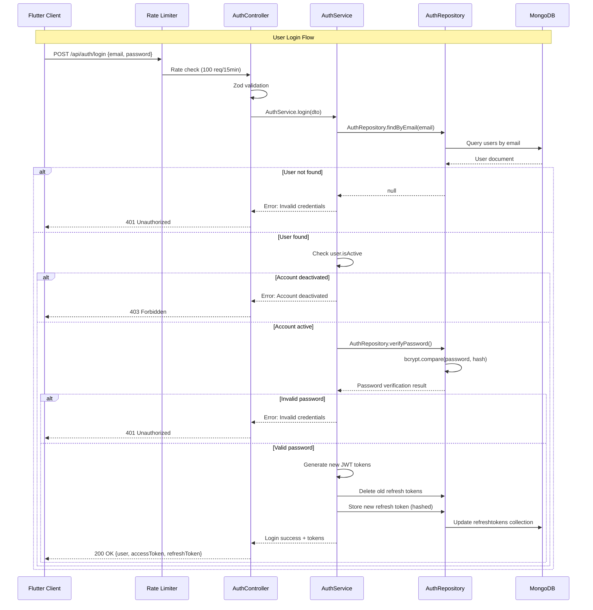
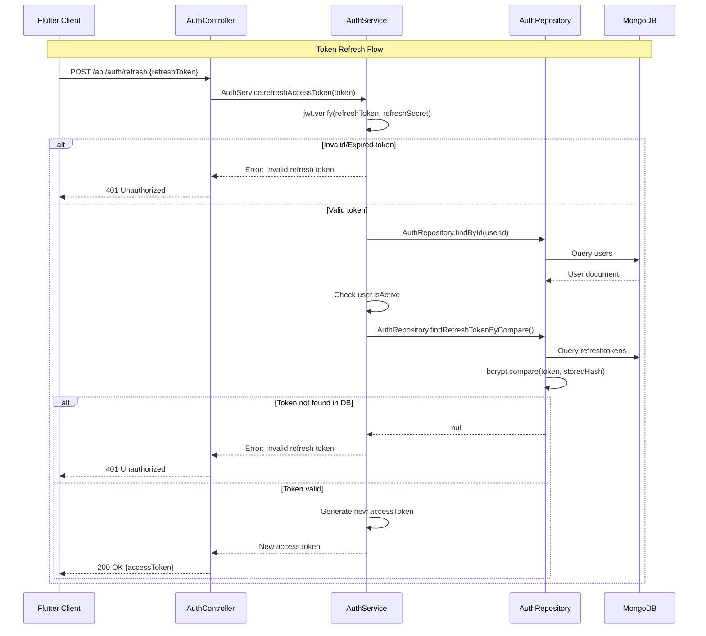
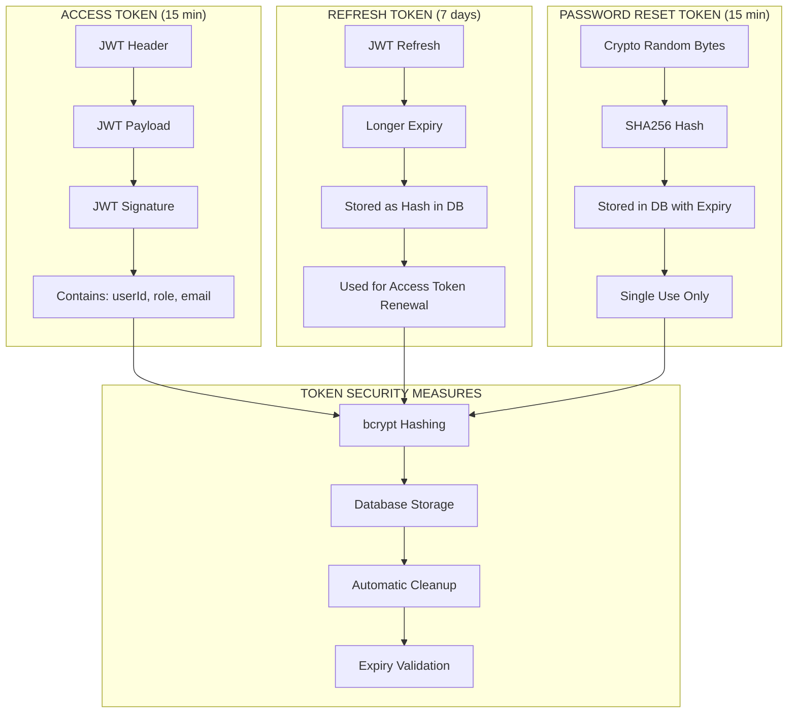
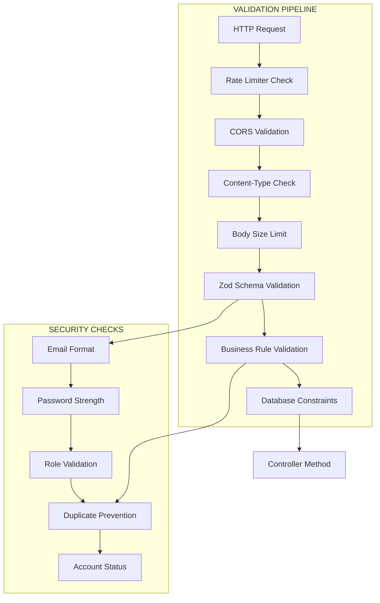
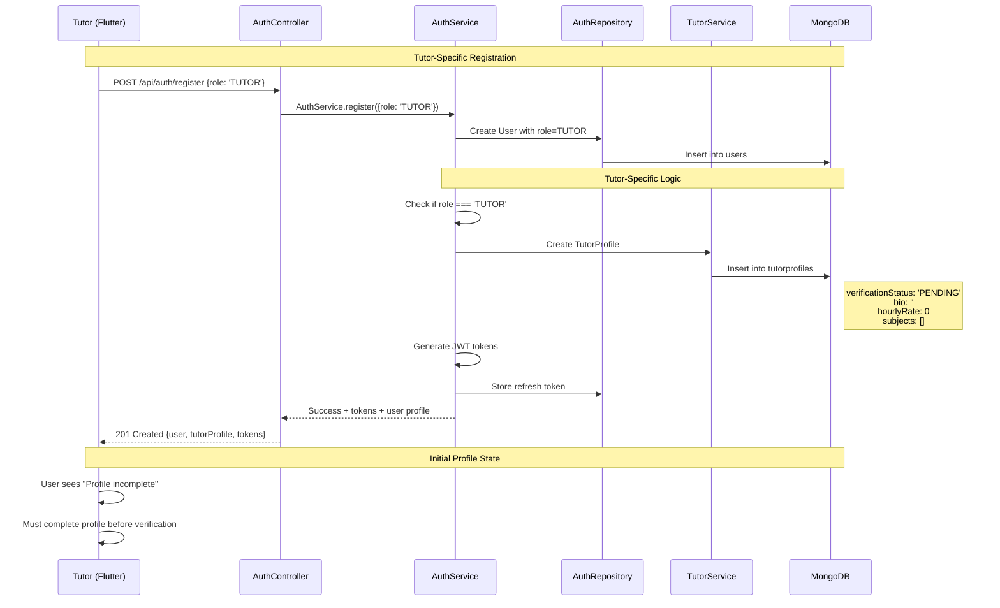

# Clean Architecture Design: Authentication & Security Flow

## 🔐 **Architecture Overview**

This document outlines the Clean Architecture design for the **User Authentication & Security** system in the LearnMentor platform, emphasizing robust security practices, token management, and role-based access control.

---

## 📋 **Table of Contents**

1. [Clean Architecture Layers](#clean-architecture-layers)
2. [Security Architecture Diagrams](#security-architecture-diagrams)
3. [Authentication Flow Sequences](#authentication-flow-sequences)
4. [Token Management Lifecycle](#token-management-lifecycle)
5. [Security Implementation Layers](#security-implementation-layers)
6. [Validation & Rate Limiting](#validation--rate-limiting)
7. [Tutor-Specific Creation Flow](#tutor-specific-creation-flow)
8. [Security Best Practices](#security-best-practices)

---

## 🏛️ **Clean Architecture Layers**

### **Layer 1: Presentation Layer (Controllers)**
**Location:** `src/modules/auth/auth.controller.ts`

**Responsibilities:**
- HTTP request/response handling
- Route parameter extraction & validation
- Input sanitization (Zod schema validation)
- Error formatting & status code mapping
- Delegate to Service layer

### **Layer 2: Application Layer (Services)**
**Location:** `src/modules/auth/auth.service.ts`

**Responsibilities:**
- Business logic orchestration
- Token generation & validation
- Cross-module coordination (TutorProfile creation)
- Email service integration
- Security policy enforcement

### **Layer 3: Domain Layer (Models & DTOs)**
**Location:** `src/modules/auth/user.model.ts`, `src/modules/auth/auth.dto.ts`

**Responsibilities:**
- Entity definitions & business rules
- Schema validation with Zod
- Type safety enforcement
- Domain constraints & relationships

### **Layer 4: Infrastructure Layer (Repositories)**
**Location:** `src/modules/auth/auth.repository.ts`

**Responsibilities:**
- Database abstraction
- Password hashing (bcrypt)
- Token storage & retrieval
- Data persistence operations

### **Layer 5: Database Layer**
**Technology:** MongoDB with Mongoose ODM

**Responsibilities:**
- Secure data storage
- Index optimization
- Query performance
- Data integrity constraints

### **Layer 6: Security Layer**
**Location:** Middleware, Configuration, JWT

**Responsibilities:**
- Rate limiting enforcement
- JWT token management
- Password security (bcrypt)
- Input validation & sanitization
- CORS & security headers

---

## 🔒 **Security Architecture Diagrams**

### **High-Level Security Architecture**



### **Authentication Security Flow**

```mermaid
graph LR
    subgraph "CLIENT REQUEST"
        A1[Flutter App] --> A2[HTTP Request]
        A2 --> A3[Authorization Header]
    end
    
    subgraph "SECURITY MIDDLEWARE PIPELINE"
        B1[Rate Limiter] --> B2[CORS Check]
        B2 --> B3[Helmet Headers]
        B3 --> B4[Body Parser]
        B4 --> B5[Zod Validation]
    end
    
    subgraph "AUTHENTICATION LAYER"
        C1[JWT Verification] --> C2[Token Extraction]
        C2 --> C3[Signature Validation]
        C3 --> C4[Expiry Check]
        C4 --> C5[User Lookup]
        C5 --> C6[Account Status Check]
    end
    
    subgraph "AUTHORIZATION LAYER"
        D1[Role Verification] --> D2[Permission Check]
        D2 --> D3[Resource Ownership]
        D3 --> D4[Business Rule Validation]
    end
    
    A3 --> B1
    B5 --> C1
    C6 --> D1
    D4 --> E[Controller Method]
```



---

## 🔄 **Authentication Flow Sequences**

### **Registration Flow (Student/Tutor)**



### **Login Flow**



### **Token Refresh Flow**



---

## 🔑 **Token Management Lifecycle**

### **JWT Token Architecture**



### **Token Storage Strategy**

| Token Type | Storage Location | Security Method | Expiry | Cleanup Strategy |
|------------|------------------|-----------------|--------|------------------|
| **Access Token** | Client Memory | JWT Signature | 15 minutes | Auto-expiry |
| **Refresh Token** | MongoDB | bcrypt hash | 7 days | Database cleanup job |
| **Reset Token** | MongoDB | SHA256 hash | 15 minutes | Auto-deletion + used flag |

### **Token Security Implementation**

```typescript
// Token Hashing Pattern (Repository Layer)
export class AuthRepository {
    // Refresh token storage with hashing
    static async storeRefreshToken(userId: string, token: string, expiresAt: Date) {
        // Remove old tokens (single-device policy)
        await RefreshToken.deleteMany({ userId });
        
        // Hash token before storage
        const tokenHash = await bcrypt.hash(token, 10);
        
        // Store hashed token
        await RefreshToken.create({
            userId,
            tokenHash,
            expiresAt
        });
    }
    
    // Secure token verification
    static async findRefreshTokenByCompare(userId: string, rawToken: string) {
        const storedTokens = await RefreshToken.find({
            userId,
            expiresAt: { $gt: new Date() }
        });
        
        // Compare with each stored hash
        for (const stored of storedTokens) {
            const isMatch = await bcrypt.compare(rawToken, stored.tokenHash);
            if (isMatch) return stored;
        }
        
        return null; // Token not found or invalid
    }
}
```

---

## 🛡️ **Security Implementation Layers**

### **Input Validation Layer (Zod Schemas)**

```typescript
// Registration validation with security rules
export const RegisterDTOSchema = z.object({
    email: z.string().email('Invalid email format'),
    password: z.string()
        .min(8, 'Password must be at least 8 characters')
        .regex(/[A-Z]/, 'Must contain uppercase letter')
        .regex(/[a-z]/, 'Must contain lowercase letter')  
        .regex(/[0-9]/, 'Must contain number')
        .regex(/[@$!%*?&#]/, 'Must contain special character'),
    role: z.enum(['STUDENT', 'TUTOR']).optional().default('STUDENT'),
    fullName: z.string().optional(),
    phone: z.string().optional(),
});

// Business rule: Prevent admin registration via public endpoints
static async register(dto: RegisterDTO) {
    const validated = RegisterDTOSchema.parse(dto);
    
    if (validated.role === 'ADMIN') {
        throw new Error('Admin accounts cannot be created via public registration');
    }
    // ... continue with registration
}
```

### **Password Security Layer**

```typescript
// bcrypt implementation with security best practices
export const bcryptConfig = {
    saltRounds: 10, // Industry standard for 2024
};

export class AuthRepository {
    // Secure password hashing
    static async hashPassword(password: string): Promise<string> {
        return bcrypt.hash(password, bcryptConfig.saltRounds);
    }
    
    // Secure password verification
    static async verifyPassword(password: string, hash: string): Promise<boolean> {
        return bcrypt.compare(password, hash);
    }
}
```

### **Rate Limiting Layer**

```typescript
// Rate limiting configuration (from routes)
const authLimiter = rateLimit({
    windowMs: 15 * 60 * 1000, // 15 minutes
    max: 100, // 100 requests per window
    message: {
        success: false,
        message: 'Too many authentication attempts. Please try again after 15 minutes.',
    },
    standardHeaders: true,
    legacyHeaders: false,
});

// Applied to sensitive endpoints
router.post('/register', authLimiter, AuthController.register);
router.post('/login', authLimiter, AuthController.login);
router.post('/forgot-password', authLimiter, AuthController.forgotPassword);
```

---

## ✅ **Validation & Rate Limiting**

### **Multi-Layer Validation Strategy**



### **Rate Limiting Strategy**

| Endpoint | Rate Limit | Window | Purpose |
|----------|------------|---------|---------|
| `/api/auth/register` | 100 req/15min | Per IP | Prevent mass account creation |
| `/api/auth/login` | 100 req/15min | Per IP | Prevent credential brute force |
| `/api/auth/forgot-password` | 100 req/15min | Per IP | Prevent email spam |
| `/api/auth/refresh` | 100 req/15min | Per IP | Prevent token abuse |

---

## 🎓 **Tutor-Specific Creation Flow**

### **Tutor Registration Process**



### **Tutor Profile Data Structure**

```javascript
// Initial TutorProfile creation
{
  user: ObjectId, // Reference to User document
  bio: "", // Empty - must be filled
  experienceYears: 0, // Must be updated
  hourlyRate: 0, // Must be set
  languages: [], // Empty array
  subjects: [], // Empty array
  verificationStatus: "PENDING", // Awaiting admin approval
  totalClasses: 0,
  rating: 0,
  reviewsCount: 0,
  averageRating: 0,
  totalReviews: 0
}
```

### **Cross-Module Integration**

```typescript
// Service Layer - Cross-module coordination
export class AuthService {
    static async register(dto: RegisterDTO) {
        // ... user creation logic
        
        // Tutor-specific profile creation
        if (role === 'TUTOR') {
            const { TutorProfile } = require('../tutor/tutor.model');
            await TutorProfile.create({ 
                user: user._id, 
                verificationStatus: 'PENDING' 
            });
        }
        
        return { user, accessToken, refreshToken };
    }
}
```

---

## 🔒 **Security Best Practices**

### **Password Security Implementation**

```typescript
// Comprehensive password validation
const passwordValidation = z.string()
    .min(8, 'Minimum 8 characters')
    .regex(/[A-Z]/, 'Requires uppercase letter')
    .regex(/[a-z]/, 'Requires lowercase letter')
    .regex(/[0-9]/, 'Requires number')
    .regex(/[@$!%*?&#]/, 'Requires special character');

// bcrypt with appropriate salt rounds
const saltRounds = 10; // ~100ms hashing time (2024 standard)
```

### **JWT Security Configuration**

```typescript
export const jwtConfig = {
    accessSecret: process.env.JWT_ACCESS_SECRET,   // Separate secrets
    refreshSecret: process.env.JWT_REFRESH_SECRET, // Different key
    accessExpiry: "15m",  // Short-lived
    refreshExpiry: "7d",  // Longer-lived
    resetTokenExpiry: "15m" // Very short for reset
};

// Token payload minimization
const accessTokenPayload = {
    userId: user._id.toString(),
    role: user.role,
    email: user.email // Only necessary fields
};
```

### **Database Security Patterns**

```javascript
// Secure indexes for performance + security
db.users.createIndex({ "email": 1 }, { unique: true });
db.users.createIndex({ "role": 1 });
db.refreshtokens.createIndex({ "userId": 1 });
db.refreshtokens.createIndex({ "expiresAt": 1 }); // Auto-cleanup
db.passwordresettokens.createIndex({ "tokenHash": 1 });
db.passwordresettokens.createIndex({ "expiresAt": 1 });

// Automatic token cleanup
db.refreshtokens.createIndex(
    { "expiresAt": 1 }, 
    { expireAfterSeconds: 0 } // TTL index
);
```

### **Error Handling Security**

```typescript
// Secure error messages (don't leak information)
export class AuthService {
    static async login(dto: LoginDTO) {
        const user = await AuthRepository.findByEmail(dto.email);
        
        if (!user || !await AuthRepository.verifyPassword(dto.password, user.passwordHash)) {
            // Same error for both cases (timing attack prevention)
            throw new Error('Invalid credentials');
        }
        
        if (!user.isActive) {
            throw new Error('Account is deactivated. Please contact support.');
        }
        
        // ... continue with successful login
    }
}
```

### **Session Management Security**

```typescript
// Single-device policy (optional)
static async storeRefreshToken(userId: string, tokenHash: string, expiresAt: Date) {
    // Remove old refresh tokens for this user
    await RefreshToken.deleteMany({ userId });
    
    // Store only the new token
    await RefreshToken.create({ userId, tokenHash, expiresAt });
}

// Logout everywhere (security feature)
static async logout(userId: string) {
    await RefreshToken.deleteMany({ userId }); // Clear all sessions
    return { message: 'Logged out from all devices' };
}
```

---

## ⚡ **Performance & Monitoring**

### **Security Monitoring Points**

```typescript
// Authentication event logging
export class AuthService {
    static async login(dto: LoginDTO) {
        try {
            const result = await this.performLogin(dto);
            
            // Log successful login
            console.log(`✅ Login successful: ${dto.email} at ${new Date().toISOString()}`);
            
            return result;
        } catch (error) {
            // Log failed login attempt
            console.warn(`❌ Login failed: ${dto.email} - ${error.message} at ${new Date().toISOString()}`);
            
            // Could trigger additional security measures here
            // (e.g., account lockout after N failed attempts)
            
            throw error;
        }
    }
}
```

### **Database Optimization for Auth**

```javascript
// Compound indexes for auth queries
db.users.createIndex({ "email": 1, "isActive": 1 });
db.refreshtokens.createIndex({ "userId": 1, "expiresAt": 1 });

// Aggregation pipeline for user lookup with profile
[
    { $match: { _id: ObjectId(userId) } },
    { 
        $lookup: {
            from: "tutorprofiles",
            localField: "_id", 
            foreignField: "user",
            as: "tutorProfile"
        }
    },
    { $unwind: { path: "$tutorProfile", preserveNullAndEmptyArrays: true } }
]
```

---

## 🧪 **Testing Strategy**

### **Security Test Categories**

```typescript
// Unit Tests - Repository Layer
describe('AuthRepository.hashPassword', () => {
    it('should hash password with bcrypt', async () => {
        const password = 'TestPassword123!';
        const hash = await AuthRepository.hashPassword(password);
        
        expect(hash).not.toBe(password);
        expect(hash.startsWith('$2b$10$')).toBe(true);
    });
});

// Integration Tests - Service Layer  
describe('AuthService.register', () => {
    it('should create tutor with profile', async () => {
        const tutorData = {
            email: 'tutor@test.com',
            password: 'Password123!',
            role: 'TUTOR'
        };
        
        const result = await AuthService.register(tutorData);
        
        expect(result.user.role).toBe('TUTOR');
        expect(result.accessToken).toBeDefined();
        expect(result.refreshToken).toBeDefined();
    });
});

// End-to-End Tests - Controller Layer
describe('POST /api/auth/login', () => {
    it('should return tokens for valid credentials', async () => {
        const response = await request(app)
            .post('/api/auth/login')
            .send({
                email: 'test@example.com',
                password: 'Password123!'
            })
            .expect(200);
            
        expect(response.body.success).toBe(true);
        expect(response.body.accessToken).toBeDefined();
    });
});
```

---

> **Summary:** This Clean Architecture design provides a robust, secure, and scalable authentication system with comprehensive token management, role-based access control, and defense-in-depth security practices. The multi-layered approach ensures separation of concerns while maintaining strong security postures across all system components.