# Clean Architecture Design: Token Management Flow

## 🔑 **Architecture Overview**

This document outlines the Clean Architecture design for the **Token Management System** in the LearnMentor platform, focusing on dual-token authentication strategy, secure token lifecycle management, and revocation mechanisms.

---

## 📋 **Table of Contents**

1. [Token Management Architecture](#token-management-architecture)
2. [Token Types & Security Models](#token-types--security-models)
3. [Clean Architecture Layers](#clean-architecture-layers)
4. [Token Flow Diagrams](#token-flow-diagrams)
5. [Security Implementation](#security-implementation)
6. [Storage & Persistence Strategy](#storage--persistence-strategy)
7. [Revocation & Cleanup Mechanisms](#revocation--cleanup-mechanisms)
8. [Performance Optimizations](#performance-optimizations)

---

## 🏛️ **Token Management Architecture**

### **High-Level Token Management System**

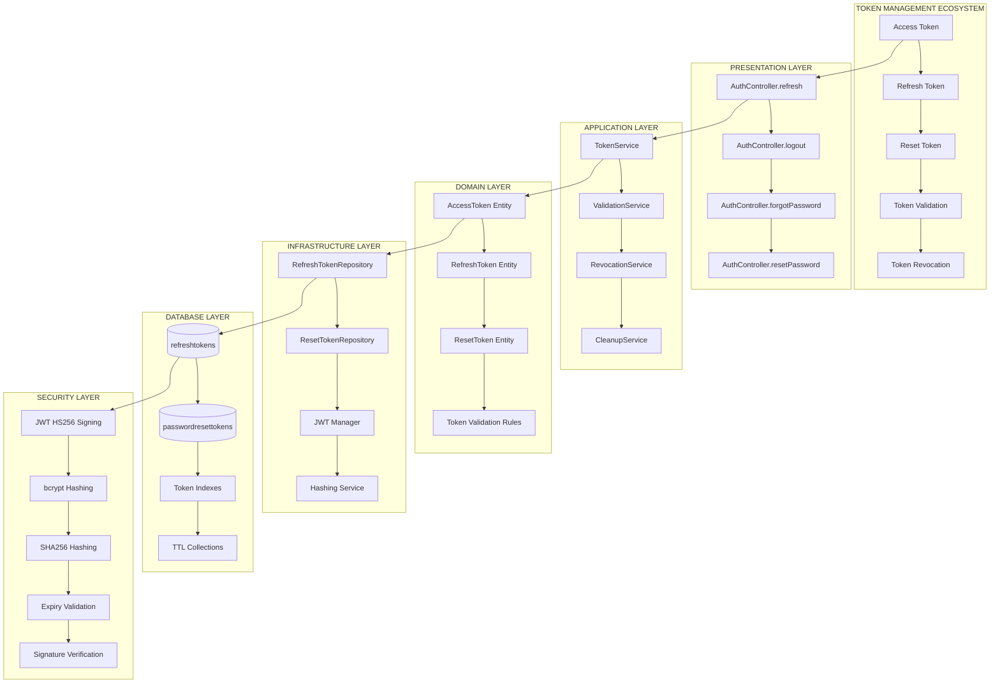

### **Dual-Token Strategy Flow**

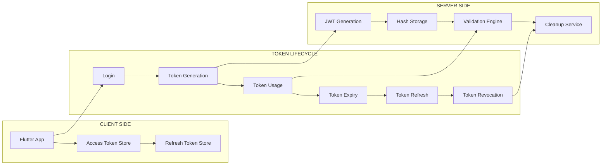

---

## 🔐 **Token Types & Security Models**

### **Token Classification & Properties**

| Token Type | Purpose | Lifetime | Storage Location | Security Method | Revocation Strategy |
|------------|---------|----------|------------------|-----------------|-------------------|
| **Access Token** | API Authentication | 15 minutes | Client Memory | JWT (HS256) | Auto-expiry |
| **Refresh Token** | Token Renewal | 7 days | Database (hashed) | bcrypt + JWT | Database deletion |
| **Reset Token** | Password Reset | 15 minutes | Database (hashed) | SHA256 + crypto.randomBytes | Single-use + expiry |

### **Token Security Model Diagram**

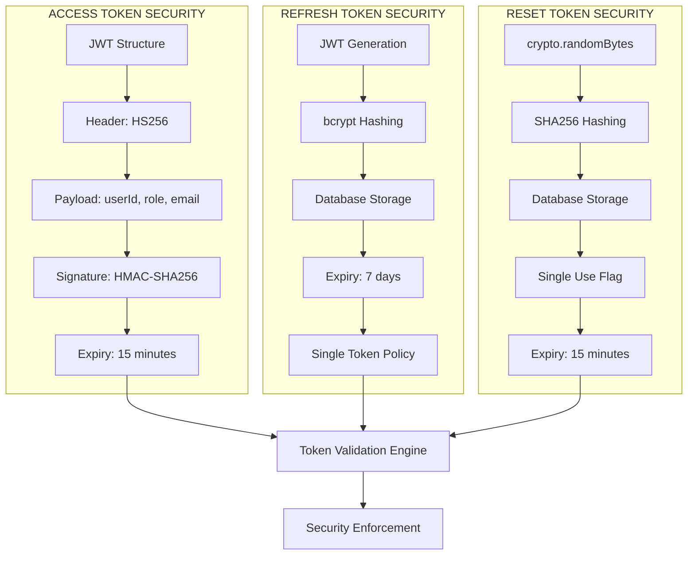

### **Token Generation Patterns**

```typescript
// Access Token Structure (JWT Payload)
interface AccessTokenPayload {
    userId: string;
    role: 'STUDENT' | 'TUTOR' | 'ADMIN';
    email: string;
    iat: number;  // Issued at
    exp: number;  // Expires at
}

// Refresh Token Database Schema
interface IRefreshToken {
    userId: string;        // User reference
    tokenHash: string;     // bcrypt hashed token
    expiresAt: Date;       // 7 days from creation
    createdAt: Date;       // Timestamp
}

// Reset Token Database Schema
interface IPasswordResetToken {
    userId: string;        // User reference
    tokenHash: string;     // SHA256 hashed token
    expiresAt: Date;       // 15 minutes from creation
    used: boolean;         // Single-use flag
    createdAt: Date;       // Timestamp
}
```

---

## 🏗️ **Clean Architecture Layers**

### **Layer 1: Presentation Layer (Controllers)**

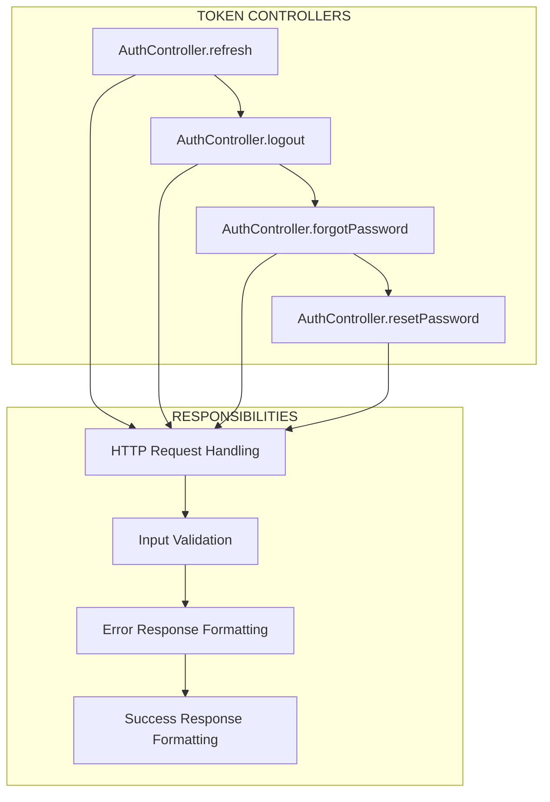

**Controller Endpoints & Responsibilities:**

```typescript
// Token Management Endpoints
POST /api/auth/refresh        → Issue new access token
POST /api/auth/logout         → Revoke all refresh tokens
POST /api/auth/forgot-password → Generate reset token
POST /api/auth/reset-password → Validate reset token & update password

// Middleware Applied:
- rateLimiter (100 req/15min)
- authenticate (for logout)
- inputValidation (Zod schemas)
```

### **Layer 2: Application Layer (Services)**

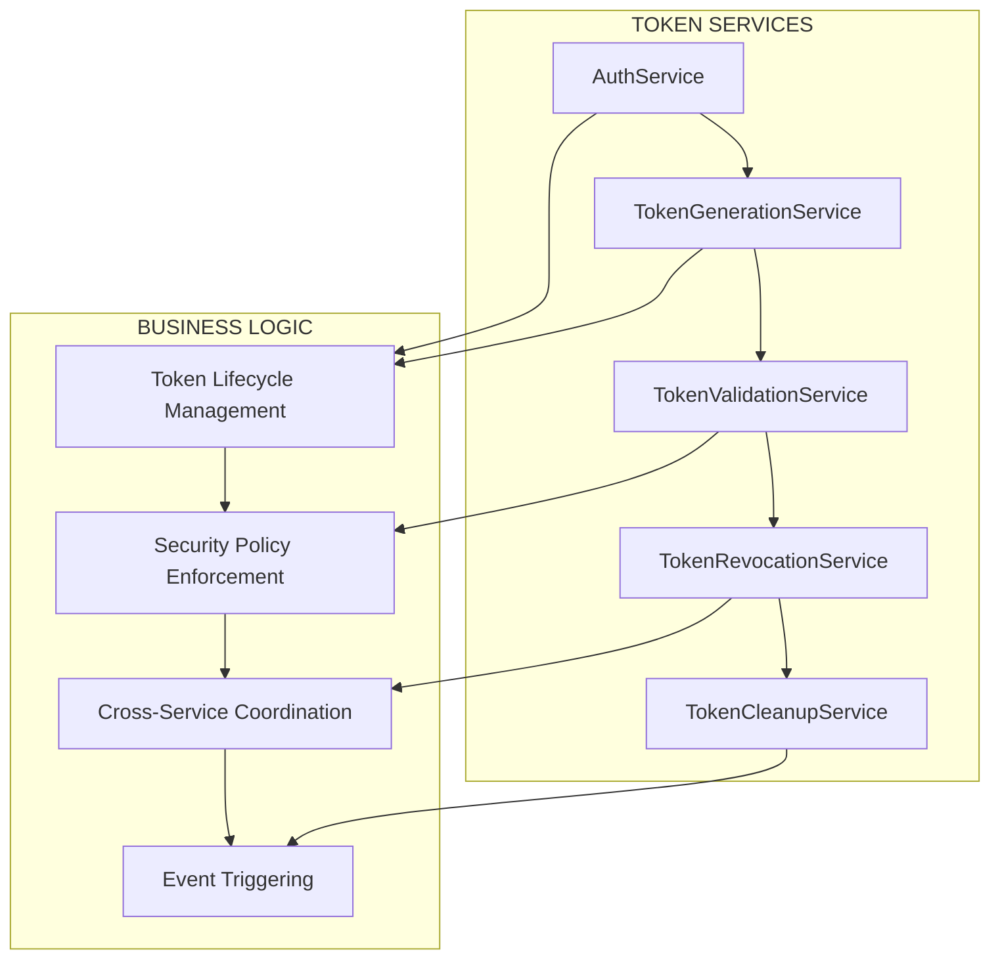

**Service Layer Implementation Patterns:**

```typescript
export class AuthService {
    // Dual-token generation
    private static async generateTokens(userId: string, role: UserRole, email: string) {
        const accessToken = jwt.sign(
            { userId, role, email },
            jwtConfig.accessSecret,
            { expiresIn: jwtConfig.accessExpiry } // 15m
        );
        
        const refreshToken = jwt.sign(
            { userId },
            jwtConfig.refreshSecret,
            { expiresIn: jwtConfig.refreshExpiry } // 7d
        );
        
        return { accessToken, refreshToken };
    }
    
    // Token refresh logic
    static async refreshAccessToken(refreshToken: string) {
        // 1. Verify JWT signature
        const payload = jwt.verify(refreshToken, jwtConfig.refreshSecret);
        
        // 2. Validate user status
        const user = await AuthRepository.findById(payload.userId);
        if (!user || !user.isActive) throw new Error('User inactive');
        
        // 3. Verify token exists in database
        const storedToken = await AuthRepository.findRefreshTokenByCompare(
            user._id.toString(), 
            refreshToken
        );
        if (!storedToken) throw new Error('Invalid refresh token');
        
        // 4. Generate new access token only
        const accessToken = jwt.sign(
            { userId: user._id.toString(), role: user.role, email: user.email },
            jwtConfig.accessSecret,
            { expiresIn: jwtConfig.accessExpiry }
        );
        
        return { accessToken };
    }
    
    // Token revocation (logout)
    static async logout(userId: string) {
        await AuthRepository.deleteRefreshToken(userId);
        return { message: 'Logged out successfully' };
    }
}
```

### **Layer 3: Domain Layer (Models & Business Rules)**

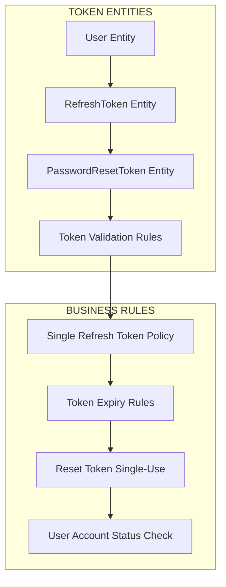

### **Layer 4: Infrastructure Layer (Repositories)**

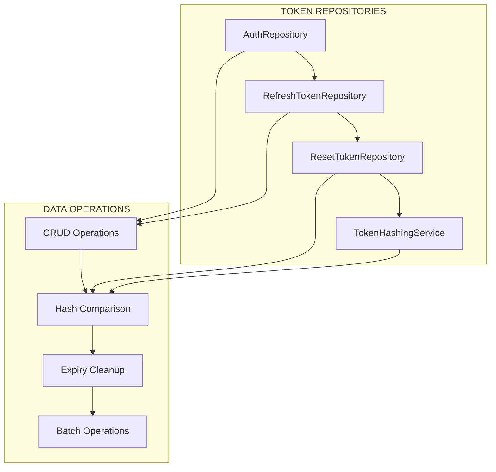

**Repository Implementation Patterns:**

```typescript
export class AuthRepository {
    // Store refresh token (single token policy)
    static async storeRefreshToken(userId: string, token: string, expiresAt: Date) {
        // Delete old tokens (enforce single token)
        await RefreshToken.deleteMany({ userId });
        
        // Hash new token with bcrypt
        const tokenHash = await bcrypt.hash(token, 10);
        
        // Store hashed token
        await RefreshToken.create({
            userId,
            tokenHash,
            expiresAt
        });
    }
    
    // Secure token comparison
    static async findRefreshTokenByCompare(userId: string, rawToken: string) {
        const storedTokens = await RefreshToken.find({
            userId,
            expiresAt: { $gt: new Date() }
        });
        
        for (const stored of storedTokens) {
            const isMatch = await bcrypt.compare(rawToken, stored.tokenHash);
            if (isMatch) return stored;
        }
        
        return null;
    }
    
    // Password reset token management
    static async createPasswordResetToken(userId: string, token: string, expiresAt: Date) {
        // Invalidate old reset tokens
        await PasswordResetToken.updateMany(
            { userId, used: false },
            { used: true }
        );
        
        // Hash token with SHA256
        const tokenHash = crypto.createHash('sha256').update(token).digest('hex');
        
        // Store new token
        await PasswordResetToken.create({
            userId,
            tokenHash,
            expiresAt,
            used: false
        });
    }
}
```

---

## 🔄 **Token Flow Diagrams**

### **Token Refresh Flow Sequence**

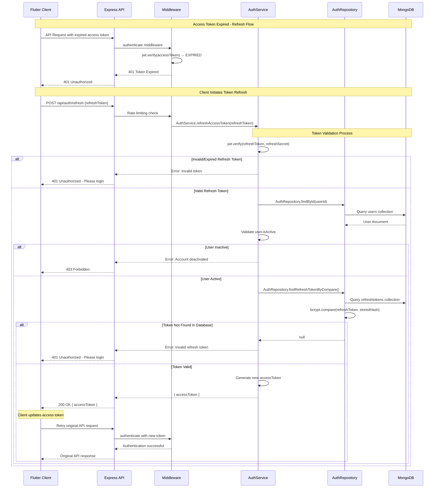

### **Token Revocation Flow Sequence**

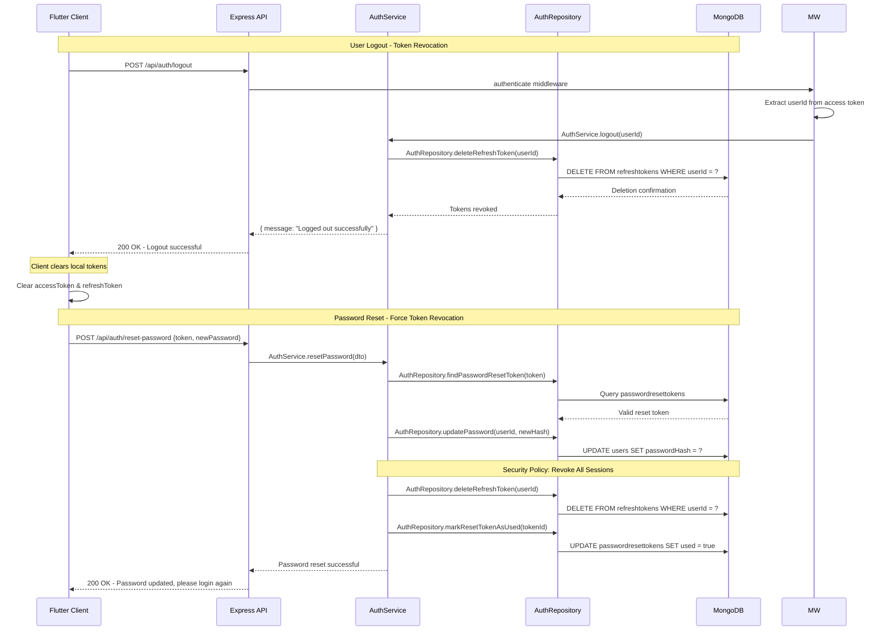

### **Password Reset Token Flow**

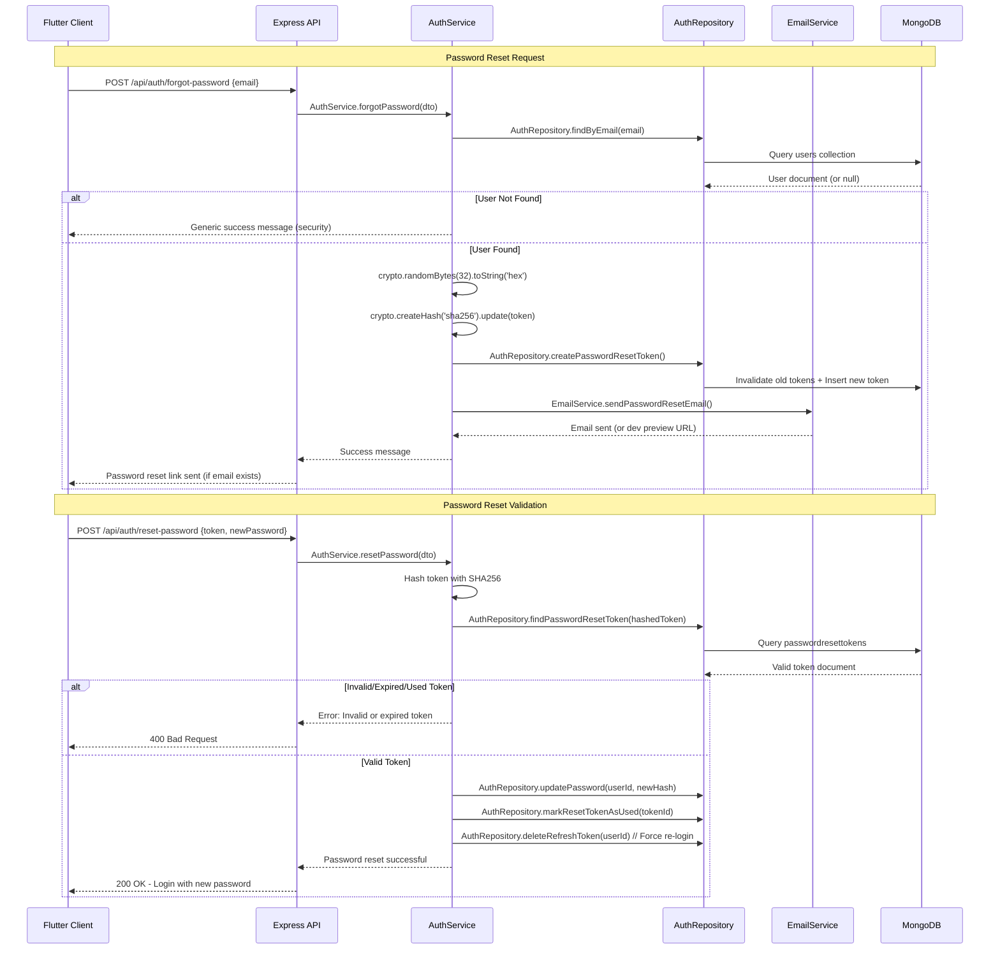

---

## 🛡️ **Security Implementation**

### **Multi-Layer Security Architecture**

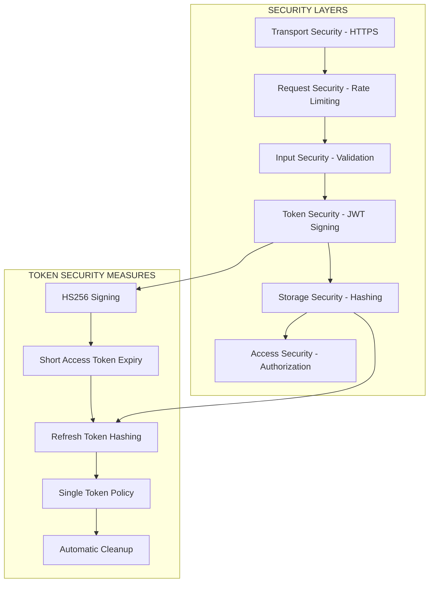

### **Token Security Configuration**

```typescript
// JWT Configuration with Security Best Practices
export const jwtConfig = {
    accessSecret: process.env.JWT_ACCESS_SECRET,   // Separate from refresh
    refreshSecret: process.env.JWT_REFRESH_SECRET, // Different secret key
    accessExpiry: "15m",    // Short-lived (15 minutes)
    refreshExpiry: "7d",    // Longer-lived (7 days)
    resetTokenExpiry: "15m", // Very short (15 minutes)
    algorithm: "HS256"      // HMAC-SHA256 signing
};

// Password hashing configuration
export const bcryptConfig = {
    saltRounds: 10,  // ~100ms hashing time (2024 standard)
};

// Security policies
export const securityPolicies = {
    singleRefreshToken: true,     // One token per user
    forceLogoutOnPasswordReset: true, // Revoke all sessions
    autoCleanupExpiredTokens: true,   // Background cleanup
    strictExpiryValidation: true      // No grace periods
};
```

### **Hashing Strategy Implementation**

```typescript
// Refresh Token Security (bcrypt)
export class RefreshTokenSecurity {
    static async hashToken(token: string): Promise<string> {
        return bcrypt.hash(token, bcryptConfig.saltRounds);
    }
    
    static async compareToken(token: string, hash: string): Promise<boolean> {
        return bcrypt.compare(token, hash);
    }
}

// Reset Token Security (SHA256)
export class ResetTokenSecurity {
    static generateToken(): string {
        return crypto.randomBytes(32).toString('hex');
    }
    
    static hashToken(token: string): string {
        return crypto.createHash('sha256').update(token).digest('hex');
    }
}

// Access Token Security (JWT)
export class AccessTokenSecurity {
    static signToken(payload: object): string {
        return jwt.sign(payload, jwtConfig.accessSecret, {
            expiresIn: jwtConfig.accessExpiry,
            algorithm: 'HS256',
            issuer: 'learnmentor-api',
            audience: 'learnmentor-clients'
        });
    }
    
    static verifyToken(token: string): object {
        return jwt.verify(token, jwtConfig.accessSecret, {
            algorithms: ['HS256'],
            issuer: 'learnmentor-api',
            audience: 'learnmentor-clients'
        });
    }
}
```

---

## 💾 **Storage & Persistence Strategy**

### **Database Schema Optimization**

```javascript
// RefreshTokens Collection Schema
{
  _id: ObjectId,
  userId: String,        // Reference to User._id
  tokenHash: String,     // bcrypt hashed refresh token
  expiresAt: Date,       // 7 days from creation
  createdAt: Date        // Timestamp for audit
}

// PasswordResetTokens Collection Schema
{
  _id: ObjectId,
  userId: String,        // Reference to User._id
  tokenHash: String,     // SHA256 hashed reset token
  expiresAt: Date,       // 15 minutes from creation
  used: Boolean,         // Single-use enforcement
  createdAt: Date        // Timestamp for audit
}

// Optimized Indexes
db.refreshtokens.createIndex({ "userId": 1 });                    // User lookup
db.refreshtokens.createIndex({ "expiresAt": 1 });                 // Cleanup queries
db.refreshtokens.createIndex({ "userId": 1, "expiresAt": 1 });    // Compound lookup

db.passwordresettokens.createIndex({ "tokenHash": 1 });           // Token lookup
db.passwordresettokens.createIndex({ "userId": 1 });              // User tokens
db.passwordresettokens.createIndex({ "expiresAt": 1 });           // Cleanup
db.passwordresettokens.createIndex({ "used": 1, "expiresAt": 1 }); // Valid tokens

// TTL Index for Automatic Cleanup
db.refreshtokens.createIndex(
    { "expiresAt": 1 }, 
    { expireAfterSeconds: 0 }  // Automatic deletion at expiry
);

db.passwordresettokens.createIndex(
    { "expiresAt": 1 }, 
    { expireAfterSeconds: 0 }  // Automatic deletion at expiry
);
```

### **Storage Security Patterns**

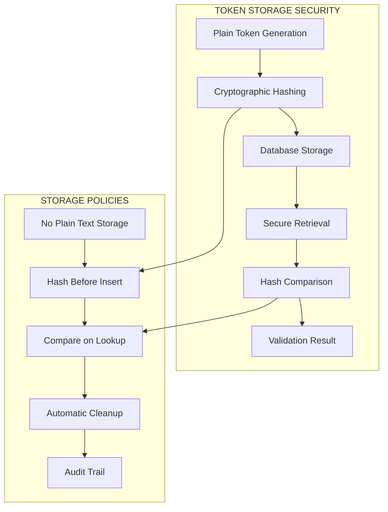

---

## 🧹 **Revocation & Cleanup Mechanisms**

### **Token Revocation Strategies**

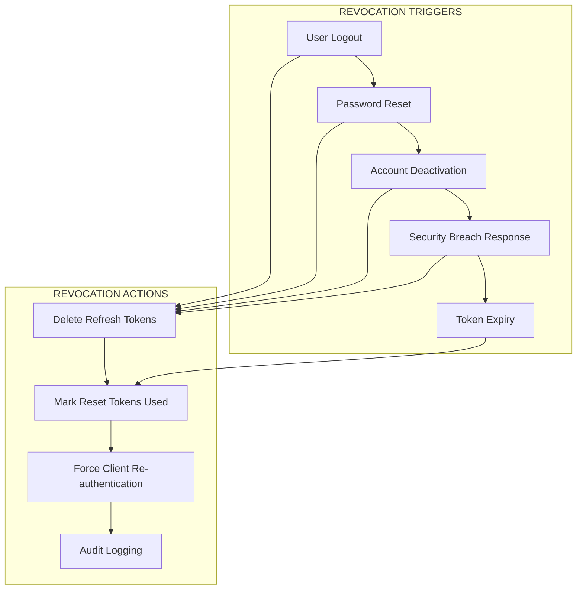

### **Cleanup Implementation**

```typescript
// Background Cleanup Service
export class TokenCleanupService {
    // Clean expired refresh tokens
    static async cleanupExpiredRefreshTokens(): Promise<void> {
        const result = await RefreshToken.deleteMany({
            expiresAt: { $lt: new Date() }
        });
        console.log(`🧹 Cleaned up ${result.deletedCount} expired refresh tokens`);
    }
    
    // Clean expired reset tokens
    static async cleanupExpiredResetTokens(): Promise<void> {
        const result = await PasswordResetToken.deleteMany({
            $or: [
                { expiresAt: { $lt: new Date() } },
                { used: true, createdAt: { $lt: new Date(Date.now() - 24 * 60 * 60 * 1000) } }
            ]
        });
        console.log(`🧹 Cleaned up ${result.deletedCount} expired/used reset tokens`);
    }
    
    // Revoke all tokens for user (security action)
    static async revokeAllUserTokens(userId: string): Promise<void> {
        await Promise.all([
            RefreshToken.deleteMany({ userId }),
            PasswordResetToken.updateMany({ userId, used: false }, { used: true })
        ]);
        console.log(`🔒 Revoked all tokens for user: ${userId}`);
    }
    
    // Scheduled cleanup (run via cron job)
    static async scheduledCleanup(): Promise<void> {
        await Promise.all([
            this.cleanupExpiredRefreshTokens(),
            this.cleanupExpiredResetTokens()
        ]);
    }
}

// Express route for manual cleanup (admin only)
router.post('/admin/cleanup-tokens', 
    authenticate, 
    authorizeRoles('ADMIN'), 
    async (req, res) => {
        await TokenCleanupService.scheduledCleanup();
        res.json({ success: true, message: 'Token cleanup completed' });
    }
);
```

### **Single Token Policy Implementation**

```typescript
// Enforce single refresh token per user
export class SingleTokenPolicy {
    static async enforcePolicy(userId: string, newToken: string): Promise<void> {
        // Delete all existing refresh tokens for user
        await RefreshToken.deleteMany({ userId });
        
        // Store new token (hashed)
        const tokenHash = await bcrypt.hash(newToken, 10);
        const expiresAt = new Date(Date.now() + 7 * 24 * 60 * 60 * 1000);
        
        await RefreshToken.create({
            userId,
            tokenHash,
            expiresAt
        });
    }
    
    // Check for multiple active tokens (security audit)
    static async auditMultipleTokens(): Promise<string[]> {
        const duplicateUsers = await RefreshToken.aggregate([
            { $group: { _id: "$userId", count: { $sum: 1 } } },
            { $match: { count: { $gt: 1 } } },
            { $project: { userId: "$_id", count: 1 } }
        ]);
        
        return duplicateUsers.map(user => user.userId);
    }
}
```

---

## ⚡ **Performance Optimizations**

### **Query Optimization Strategies**

```typescript
// Optimized token queries with projection
export class OptimizedTokenRepository {
    // Fast token lookup with minimal data transfer
    static async findActiveRefreshToken(userId: string): Promise<boolean> {
        const token = await RefreshToken.findOne(
            { 
                userId, 
                expiresAt: { $gt: new Date() } 
            },
            { _id: 1 }  // Project only _id (existence check)
        );
        
        return !!token;
    }
    
    // Batch token operations
    static async cleanupExpiredTokensBatch(batchSize: number = 1000): Promise<number> {
        let totalDeleted = 0;
        let hasMore = true;
        
        while (hasMore) {
            const result = await RefreshToken.deleteMany(
                { expiresAt: { $lt: new Date() } },
                { limit: batchSize }
            );
            
            totalDeleted += result.deletedCount;
            hasMore = result.deletedCount === batchSize;
            
            // Prevent overwhelming the database
            if (hasMore) {
                await new Promise(resolve => setTimeout(resolve, 100));
            }
        }
        
        return totalDeleted;
    }
}
```

### **Caching Strategy for Token Validation**

```typescript
// Redis cache for frequently accessed token data
export class TokenCacheService {
    private static cache = new Map<string, any>();
    private static readonly CACHE_TTL = 5 * 60 * 1000; // 5 minutes
    
    // Cache user status for token validation
    static async getUserStatus(userId: string): Promise<{isActive: boolean, role: string} | null> {
        const cacheKey = `user_status_${userId}`;
        
        if (this.cache.has(cacheKey)) {
            const cached = this.cache.get(cacheKey);
            if (Date.now() < cached.expiry) {
                return cached.data;
            }
        }
        
        const user = await User.findById(userId, { isActive: 1, role: 1 });
        if (!user) return null;
        
        const userData = { isActive: user.isActive, role: user.role };
        this.cache.set(cacheKey, {
            data: userData,
            expiry: Date.now() + this.CACHE_TTL
        });
        
        return userData;
    }
    
    // Invalidate cache on user update
    static invalidateUserCache(userId: string): void {
        this.cache.delete(`user_status_${userId}`);
    }
}
```

---

## 📊 **Monitoring & Analytics**

### **Token Usage Analytics**

```typescript
// Token metrics collection
export class TokenMetricsService {
    // Track token refresh frequency
    static async trackTokenRefresh(userId: string): Promise<void> {
        // Could integrate with metrics service (Prometheus, etc.)
        console.log(`📊 Token refresh: ${userId} at ${new Date().toISOString()}`);
    }
    
    // Monitor suspicious token activity
    static async detectSuspiciousActivity(userId: string): Promise<boolean> {
        const recentRefreshes = await RefreshToken.countDocuments({
            userId,
            createdAt: { $gt: new Date(Date.now() - 60 * 60 * 1000) } // Last hour
        });
        
        // Flag if more than 10 refreshes in an hour
        return recentRefreshes > 10;
    }
    
    // Generate token usage report
    static async generateUsageReport() {
        const stats = await Promise.all([
            RefreshToken.countDocuments({}),
            RefreshToken.countDocuments({ expiresAt: { $lt: new Date() } }),
            PasswordResetToken.countDocuments({ used: false }),
            PasswordResetToken.countDocuments({ used: true })
        ]);
        
        return {
            activeRefreshTokens: stats[0],
            expiredRefreshTokens: stats[1],
            pendingResetTokens: stats[2],
            usedResetTokens: stats[3],
            timestamp: new Date().toISOString()
        };
    }
}
```

---

> **Summary:** This Clean Architecture design provides a comprehensive, secure, and performant token management system with dual-token strategy, robust revocation mechanisms, and automated cleanup processes. The multi-layered security approach ensures token integrity while maintaining excellent system performance and maintainability.