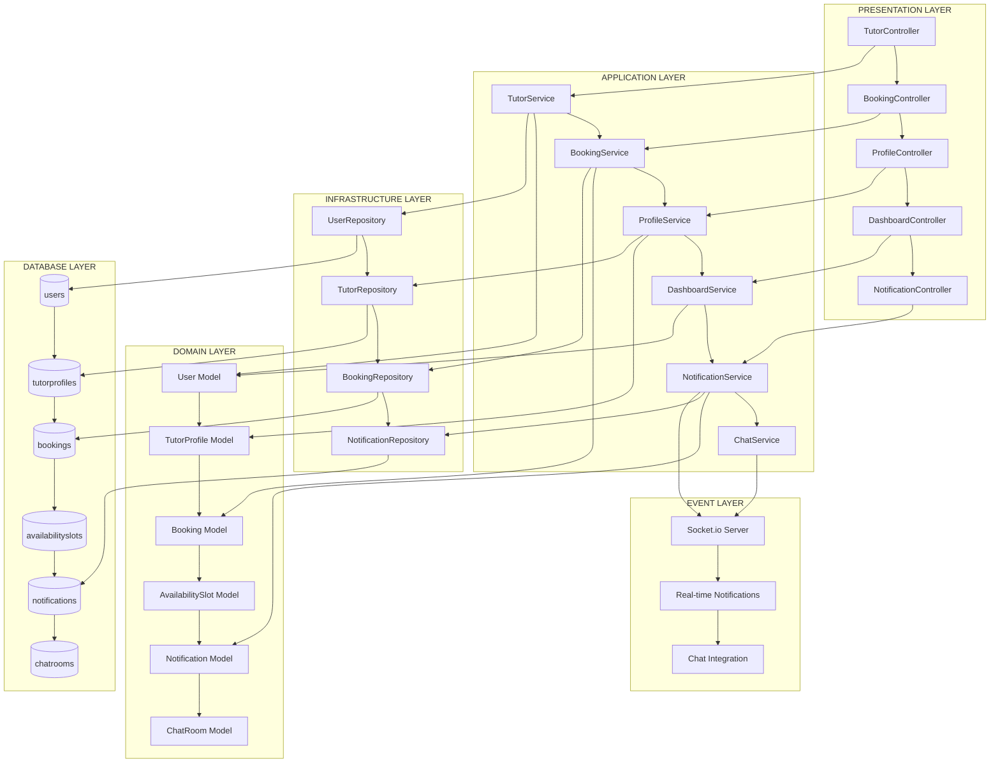
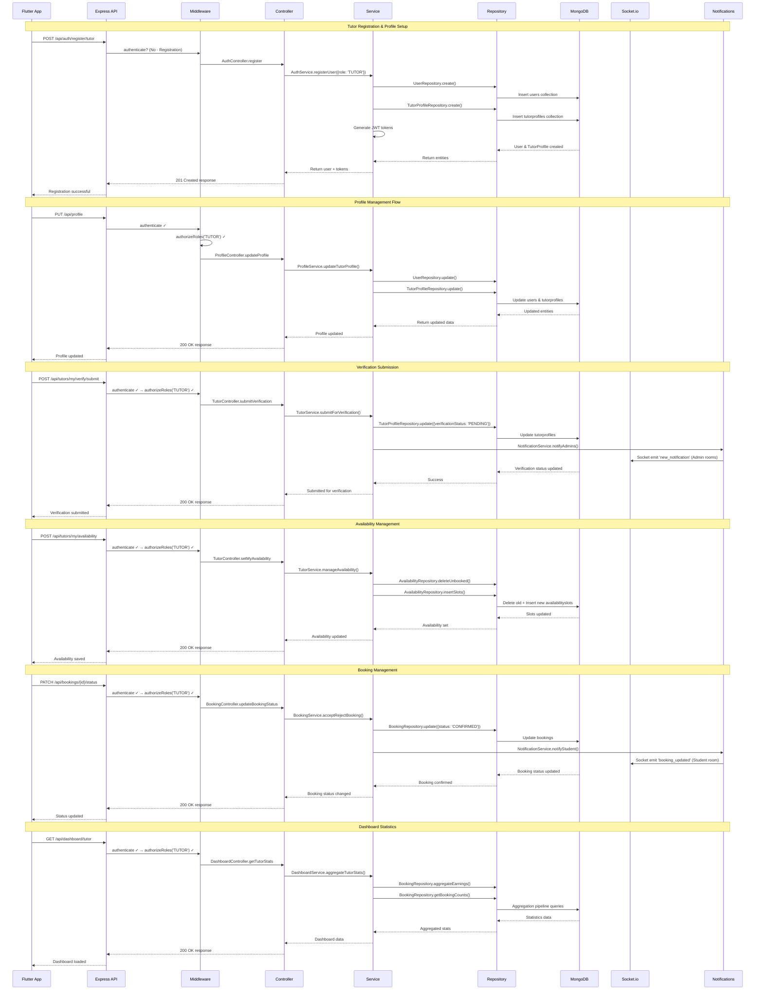
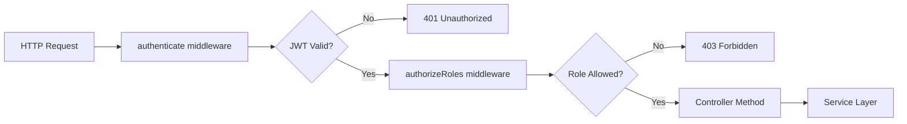
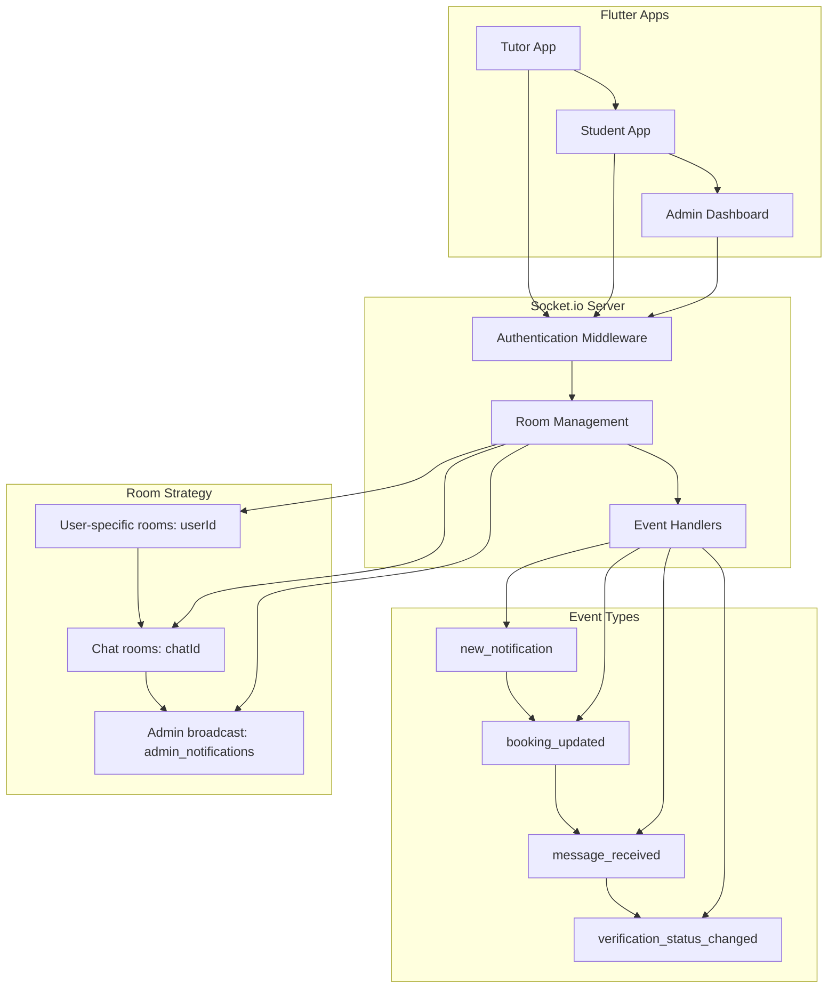
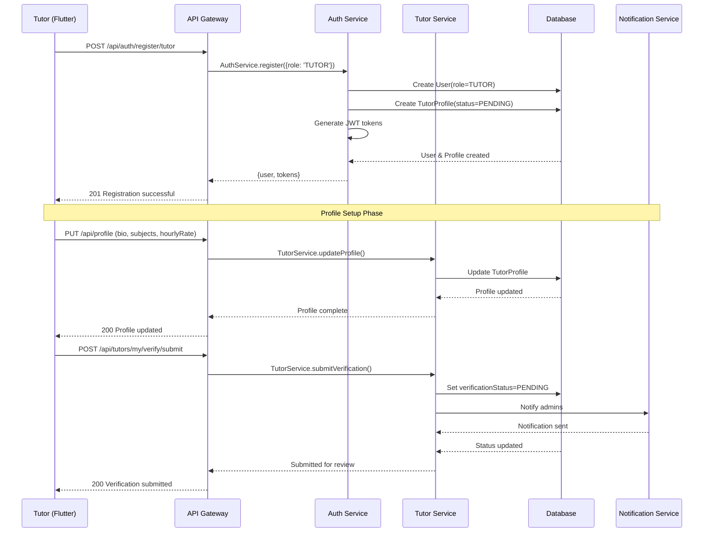
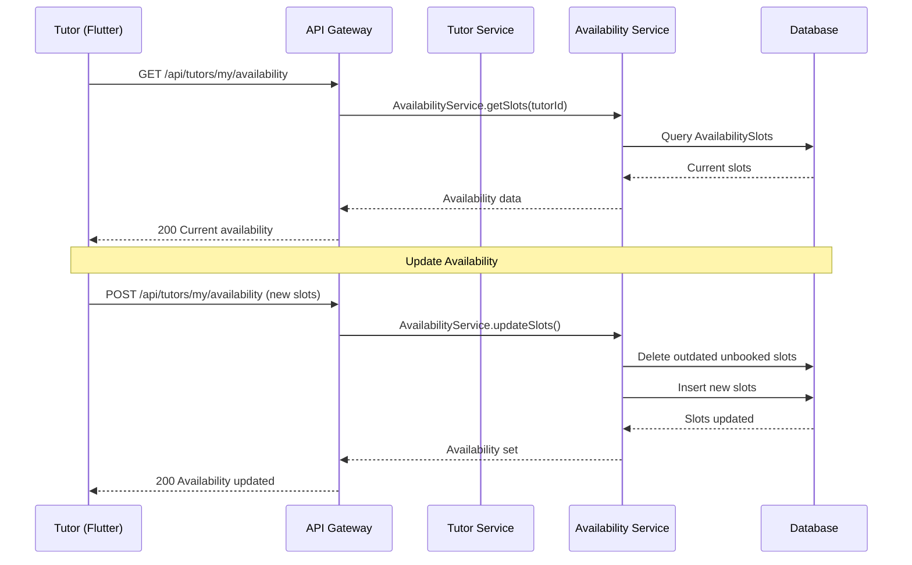
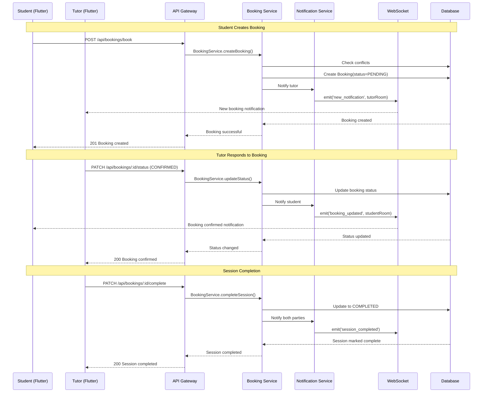

# Clean Architecture Design: Tutor Workflow System

## 🏗️ **Architecture Overview**

This document outlines the Clean Architecture design for the **Tutor Registration, Profile Management, Availability & Booking Management** workflow in the LearnMentor platform.

---

## 📋 **Table of Contents**

1. [Clean Architecture Layers](#clean-architecture-layers)
2. [Architecture Diagrams](#architecture-diagrams)
3. [Layer-by-Layer Flow](#layer-by-layer-flow)
4. [Role-Based Access Control](#role-based-access-control)
5. [Real-Time Event System](#real-time-event-system)
6. [Sequence Flows](#sequence-flows)
7. [Error Handling Strategy](#error-handling-strategy)

---

## 🏛️ **Clean Architecture Layers**

### **Layer 1: Presentation Layer (Controllers)**
**Location:** `src/modules/*/controller.ts`

**Responsibilities:**
- Handle HTTP requests/responses
- Input validation (Zod schemas)
- Route parameter extraction
- Delegate to Service layer
- Format response data

### **Layer 2: Application Layer (Services)**
**Location:** `src/modules/*/service.ts`

**Responsibilities:**
- Business logic orchestration
- Cross-module coordination
- Transaction management
- Event triggering
- Data transformation

### **Layer 3: Domain Layer (Models & DTOs)**
**Location:** `src/modules/*/model.ts`, `src/modules/*/dto.ts`

**Responsibilities:**
- Entity definitions
- Business rules
- Data validation schemas
- Type definitions
- Domain constraints

### **Layer 4: Infrastructure Layer (Repositories)**
**Location:** `src/modules/*/repository.ts` (implied in services)

**Responsibilities:**
- Database abstraction
- Query optimization
- Data persistence
- External service integration
- Caching strategies

### **Layer 5: Database Layer**
**Technology:** MongoDB with Mongoose ODM

**Responsibilities:**
- Data storage
- ACID compliance
- Indexing
- Aggregations
- Performance optimization

### **Layer 6: Event Layer**
**Technology:** Socket.io + Notification System

**Responsibilities:**
- Real-time communication
- Event broadcasting
- Push notifications
- Cross-module messaging

---

## 🔄 **Architecture Diagrams**

### **High-Level Clean Architecture Flow**



### **Tutor Workflow Data Flow Diagram**



---

## 🔄 **Layer-by-Layer Flow**

### **1. Presentation Layer (Controllers)**

**File Locations:**
- `src/modules/auth/auth.controller.ts`
- `src/modules/tutor/tutor.controller.ts` 
- `src/modules/booking/booking.controller.ts`
- `src/modules/profile/profile.controller.ts`
- `src/modules/dashboard/dashboard.controller.ts`

**Key Responsibilities:**
```typescript
// Example Controller Pattern
export class TutorController {
    static async submitVerification(req: AuthRequest, res: Response) {
        try {
            // 1. Extract & validate inputs
            const tutorId = req.user.userId;
            
            // 2. Delegate to Service layer
            await TutorService.submitForVerification(tutorId);
            
            // 3. Format response
            res.status(200).json({
                success: true,
                message: 'Profile submitted for verification'
            });
        } catch (error) {
            // 4. Handle errors uniformly
            this.handleControllerError(res, error);
        }
    }
}
```

**API Endpoints Mapping:**
| Endpoint | Controller | Method | Middleware |
|----------|------------|--------|------------|
| `POST /api/auth/register/tutor` | AuthController | `register` | `authLimiter` |
| `PUT /api/profile` | ProfileController | `updateProfile` | `authenticate` + `authorizeRoles('TUTOR')` |
| `POST /api/tutors/my/verify/submit` | TutorController | `submitVerification` | `authenticate` + `authorizeRoles('TUTOR')` |
| `POST /api/tutors/my/availability` | TutorController | `setMyAvailability` | `authenticate` + `authorizeRoles('TUTOR')` |
| `GET /api/bookings` | BookingController | `getBookings` | `authenticate` + `authorizeRoles('TUTOR')` |
| `PATCH /api/bookings/:id/status` | BookingController | `updateBookingStatus` | `authenticate` + `authorizeRoles('TUTOR')` |
| `PATCH /api/bookings/:id/complete` | BookingController | `completeBooking` | `authenticate` + `authorizeRoles('TUTOR')` |
| `GET /api/dashboard/tutor` | DashboardController | `getTutorStats` | `authenticate` + `authorizeRoles('TUTOR')` |

### **2. Application Layer (Services)**

**File Locations:**
- `src/modules/auth/auth.service.ts`
- `src/modules/tutor/tutor.service.ts`
- `src/modules/booking/booking.service.ts` (implied)
- `src/modules/profile/profile.service.ts` (implied)
- `src/modules/dashboard/dashboard.service.ts` (implied)

**Business Logic Coordination:**
```typescript
// Example Service Pattern
export class TutorService {
    static async submitForVerification(tutorId: string) {
        // 1. Validate business rules
        const tutorProfile = await TutorProfileRepository.findByUserId(tutorId);
        if (!tutorProfile) throw new Error('Tutor profile not found');
        if (tutorProfile.verificationStatus === 'VERIFIED') {
            throw new Error('Already verified');
        }
        
        // 2. Update verification status
        await TutorProfileRepository.update(tutorId, {
            verificationStatus: 'PENDING'
        });
        
        // 3. Trigger cross-module events
        await NotificationService.notifyAdmins(
            'TUTOR_VERIFICATION_PENDING',
            { tutorId, tutorName: tutorProfile.user.fullName }
        );
        
        // 4. Return success
        return { success: true };
    }
}
```

**Cross-Module Coordination:**
- **TutorService** ↔ **NotificationService** (verification alerts)
- **BookingService** ↔ **ChatService** (auto-create chat rooms)
- **BookingService** ↔ **TransactionService** (payment processing)
- **DashboardService** ↔ **BookingService** (earnings aggregation)

### **3. Domain Layer (Models & DTOs)**

**File Locations:**
- `src/modules/auth/user.model.ts`
- `src/modules/tutor/tutor.model.ts`
- `src/modules/booking/booking.model.ts`
- `src/modules/tutor/tutor.dto.ts`

**Entity Relationships:**
```typescript
// Core Domain Models
interface IUser {
    _id: ObjectId;
    fullName?: string;
    email: string;
    role: 'STUDENT' | 'TUTOR' | 'ADMIN';
    isVerified: boolean;
    isActive: boolean;
    // ... other fields
}

interface ITutorProfile {
    user: ObjectId;  // References User._id
    bio: string;
    experienceYears: number;
    hourlyRate: number;
    subjects: string[];
    languages: string[];
    verificationStatus: 'PENDING' | 'VERIFIED' | 'REJECTED';
    // ... other fields
}

interface IBooking {
    student: ObjectId;  // References User._id
    tutor: ObjectId;    // References User._id
    status: BookingStatus;
    startTime: Date;
    endTime: Date;
    price: number;
    // ... other fields
}

interface IAvailabilitySlot {
    tutorId: ObjectId;  // References User._id
    startTime: Date;
    endTime: Date;
    isBooked: boolean;
}
```

### **4. Infrastructure Layer (Repositories)**

**Pattern Implementation:**
```typescript
// Repository Pattern (embedded in services)
export class TutorRepository {
    static async findByUserId(userId: string): Promise<ITutorProfile | null> {
        return await TutorProfile.findOne({ user: userId }).populate('user');
    }
    
    static async updateVerificationStatus(
        userId: string, 
        status: VerificationStatus
    ): Promise<ITutorProfile> {
        return await TutorProfile.findOneAndUpdate(
            { user: userId },
            { verificationStatus: status },
            { new: true }
        );
    }
    
    static async aggregateEarnings(tutorId: string, dateRange: DateRange) {
        return await Booking.aggregate([
            { $match: { tutor: tutorId, status: 'COMPLETED' } },
            { $group: { _id: null, totalEarnings: { $sum: '$price' } } }
        ]);
    }
}
```

### **5. Database Layer**

**Collections & Indexes:**
```javascript
// users collection
{
  _id: ObjectId,
  fullName: String,
  email: String (unique),
  role: String (indexed),
  isVerified: Boolean,
  isActive: Boolean
}

// tutorprofiles collection  
{
  _id: ObjectId,
  user: ObjectId (unique, ref: users),
  verificationStatus: String (indexed),
  hourlyRate: Number (indexed),
  subjects: [String] (indexed),
  languages: [String] (indexed),
  rating: Number (indexed desc)
}

// bookings collection
{
  _id: ObjectId,
  student: ObjectId (indexed, ref: users),
  tutor: ObjectId (indexed, ref: users), 
  status: String (indexed),
  startTime: Date (indexed),
  endTime: Date,
  price: Number
}

// availabilityslots collection
{
  _id: ObjectId,
  tutorId: ObjectId (indexed, ref: users),
  startTime: Date (compound index with tutorId),
  endTime: Date,
  isBooked: Boolean (indexed)
}
```

---

## 🔒 **Role-Based Access Control**

### **Middleware Authentication Flow**



### **Role-Based Endpoint Access**

| Endpoint | Allowed Roles | Additional Checks |
|----------|---------------|-------------------|
| `POST /api/auth/register/tutor` | `Public` | Rate limiting |
| `PUT /api/profile` | `TUTOR` | Own profile only |
| `POST /api/tutors/my/verify/submit` | `TUTOR` | Profile completeness |
| `POST /api/tutors/my/availability` | `TUTOR` | Future dates only |
| `PATCH /api/bookings/:id/status` | `TUTOR` | Own bookings only |
| `GET /api/dashboard/tutor` | `TUTOR` | Own data only |

### **Ownership Validation Pattern**

```typescript
// Service-level ownership checks
export class BookingService {
    static async updateBookingStatus(bookingId: string, tutorId: string, status: string) {
        // 1. Find booking and validate ownership
        const booking = await Booking.findById(bookingId);
        if (!booking) throw new Error('Booking not found');
        if (booking.tutor.toString() !== tutorId) {
            throw new Error('Access denied: Not your booking');
        }
        
        // 2. Validate business rules
        if (!['CONFIRMED', 'REJECTED'].includes(status)) {
            throw new Error('Invalid status');
        }
        
        // 3. Update and notify
        await booking.updateOne({ status });
        await NotificationService.notifyStudent(booking.student, 'BOOKING_UPDATED');
    }
}
```

---

## 🔄 **Real-Time Event System**

### **Socket.io Integration Architecture**



### **Notification Event Triggers**

| Event Trigger | Target Audience | Socket Event | Notification Type |
|---------------|-----------------|--------------|-------------------|
| Tutor submits verification | Admins | `new_notification` | `TUTOR_VERIFICATION_PENDING` |
| Booking created | Tutors | `new_notification` | `BOOKING_CREATED` |
| Booking accepted/rejected | Students | `booking_updated` | `BOOKING_STATUS_CHANGED` |
| Booking completed | Both parties | `booking_updated` | `SESSION_COMPLETED` |
| Payment completed | Tutor | `new_notification` | `PAYMENT_RECEIVED` |
| Chat message sent | Chat participants | `receive_message` | `NEW_MESSAGE` |

### **Real-Time Implementation Pattern**

```typescript
// Service layer event emission
export class NotificationService {
    static async notifyBookingCreated(booking: IBooking) {
        // 1. Create notification record
        const notification = await NotificationRepository.create({
            userId: booking.tutor,
            type: 'BOOKING_CREATED',
            title: 'New Booking Request',
            message: `You have a new booking request for ${booking.startTime}`,
            data: { bookingId: booking._id }
        });
        
        // 2. Emit real-time event
        if (io) {
            io.to(booking.tutor.toString()).emit('new_notification', {
                notification,
                timestamp: new Date()
            });
        }
        
        return notification;
    }
}
```

---

## 🔄 **Sequence Flows**

### **1. Tutor Registration & Setup Flow**



### **2. Availability Management Flow**



### **3. Booking Management Flow**



---

## ⚠️ **Error Handling Strategy**

### **Error Categories & Handlers**

| Error Type | HTTP Status | Handler Location | Response Format |
|------------|-------------|------------------|------------------|
| **Validation Errors** | 400 | Controller + Zod | `{success: false, errors: [...]}` |
| **Authentication Errors** | 401 | Middleware | `{success: false, message: "Token expired"}` |
| **Authorization Errors** | 403 | Middleware | `{success: false, message: "Access denied"}` |
| **Business Logic Errors** | 409 | Service | `{success: false, message: "Booking conflict"}` |
| **Resource Not Found** | 404 | Service | `{success: false, message: "Tutor not found"}` |
| **Server Errors** | 500 | Global Handler | `{success: false, message: "Internal error"}` |

### **Error Propagation Pattern**

```typescript
// Repository Level
export class TutorRepository {
    static async findById(id: string) {
        try {
            return await TutorProfile.findById(id);
        } catch (dbError) {
            throw new DatabaseError('Failed to fetch tutor', dbError);
        }
    }
}

// Service Level  
export class TutorService {
    static async submitVerification(tutorId: string) {
        const profile = await TutorRepository.findById(tutorId);
        if (!profile) {
            throw new NotFoundError('Tutor profile not found');
        }
        if (profile.verificationStatus === 'VERIFIED') {
            throw new BusinessLogicError('Already verified');
        }
        // ... continue processing
    }
}

// Controller Level
export class TutorController {
    static async submitVerification(req: AuthRequest, res: Response) {
        try {
            await TutorService.submitVerification(req.user.userId);
            res.status(200).json({ success: true });
        } catch (error) {
            if (error instanceof NotFoundError) {
                return res.status(404).json({ success: false, message: error.message });
            }
            if (error instanceof BusinessLogicError) {
                return res.status(409).json({ success: false, message: error.message });
            }
            // Global error handler catches remaining
            throw error;
        }
    }
}
```

---

## 📊 **Performance Optimizations**

### **Database Indexing Strategy**

```javascript
// Optimized indexes for tutor workflow
db.tutorprofiles.createIndex({ "verificationStatus": 1 });
db.tutorprofiles.createIndex({ "hourlyRate": 1 });
db.tutorprofiles.createIndex({ "subjects": 1 });
db.tutorprofiles.createIndex({ "rating": -1 });

db.bookings.createIndex({ "tutor": 1, "status": 1 });
db.bookings.createIndex({ "tutor": 1, "startTime": 1, "endTime": 1 }); // Conflict detection

db.availabilityslots.createIndex({ "tutorId": 1, "startTime": 1 });
db.availabilityslots.createIndex({ "tutorId": 1, "isBooked": 1, "startTime": 1 });
```

### **Caching Strategy**

```typescript
// Service-level caching for frequent queries
export class TutorService {
    private static cache = new Map();
    
    static async getTutorProfile(tutorId: string) {
        const cacheKey = `tutor_profile_${tutorId}`;
        
        if (this.cache.has(cacheKey)) {
            return this.cache.get(cacheKey);
        }
        
        const profile = await TutorRepository.findById(tutorId);
        this.cache.set(cacheKey, profile);
        
        // Cache expiry
        setTimeout(() => this.cache.delete(cacheKey), 300000); // 5 minutes
        
        return profile;
    }
}
```

---

## 🔧 **Development & Testing Guidelines**

### **Module Testing Strategy**

```typescript
// Unit Test Example
describe('TutorService.submitVerification', () => {
    beforeEach(() => {
        jest.clearAllMocks();
    });
    
    it('should submit tutor for verification', async () => {
        // Arrange
        const mockTutor = { verificationStatus: 'PENDING' };
        TutorRepository.findById = jest.fn().mockResolvedValue(mockTutor);
        TutorRepository.update = jest.fn().mockResolvedValue(mockTutor);
        NotificationService.notifyAdmins = jest.fn();
        
        // Act
        await TutorService.submitVerification('tutor123');
        
        // Assert
        expect(TutorRepository.update).toHaveBeenCalledWith('tutor123', {
            verificationStatus: 'PENDING'
        });
        expect(NotificationService.notifyAdmins).toHaveBeenCalled();
    });
});
```

### **Integration Testing**

```typescript
// API Integration Test
describe('POST /api/tutors/my/verify/submit', () => {
    it('should submit tutor for verification', async () => {
        const response = await request(app)
            .post('/api/tutors/my/verify/submit')
            .set('Authorization', `Bearer ${tutorToken}`)
            .expect(200);
            
        expect(response.body.success).toBe(true);
        expect(response.body.message).toContain('verification');
    });
});
```

---

> **Summary:** This Clean Architecture design ensures separation of concerns, maintainable code structure, robust error handling, and scalable real-time features for the tutor workflow system. The modular approach allows for independent testing, easy feature additions, and clear responsibility boundaries across all system layers.